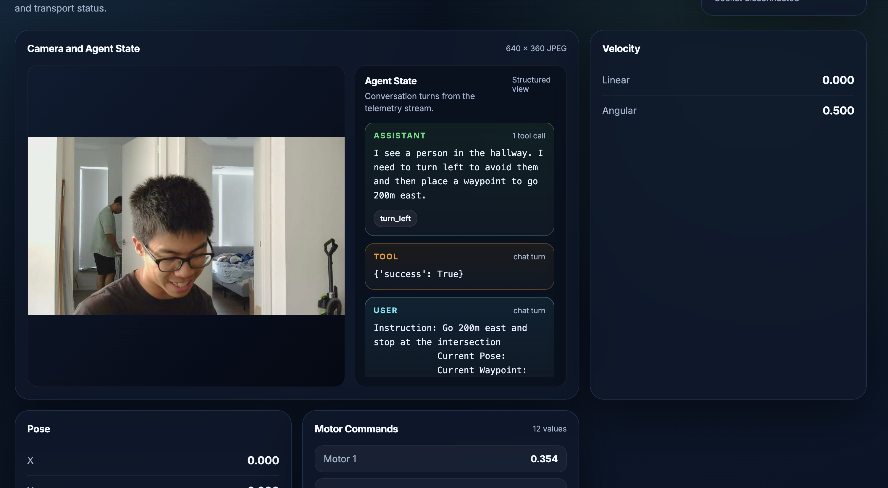

==NOTE: PROJECT IN PROGRESS.==
# Urban Autonomous Rover
Embodied intelligence and autonomy is a rapidly expanding area of research. Despite the ample end-to-end navigation and object avoidance work for small ground vehicles, there lack a open source solution for generalized urban navigation.

Urban navigation not only requires planning, path following, object avoidance, etc., it also demands more nuanced scene understanding and decision making, like navigating a controlled intersection.

This project aims to leverage the general knowledge of LLM models and a low-level navigation model to enable small ground rovers to robustly navigate urban environments.

Moreover, we are working under a budget and energy constrain so we choose to use only a commercial webcam for autonomy. For rapid prototyping, we developed ***iSLAM***, a framework to bridge iPhone pose estimation and GPS ability to a onboard computer.

> Rover under sunlight

# Rover Performance
***We have not tested the autonomy of the rover.*** The manual controller can be run with `bash manuel.bash` after connecting your iPhone joystick to the Jetson hotspot.

<video src="assets/demo.mp4" width="320" height="240" controls></video>

**Dashboard**
A dashboard server also can be used to monitor autonomy status wirelessly.

# Autonomy Stack
### High-level agent
We used Ollama for local VLM inference. Between open source models, we found that Jetson can inference at our target frequency (0.2Hz) without OOM error for VLMs below 2 billion parameters. We choose `Qwen3.5:2b` for its visual understanding and pointing ability.

The agent receives current observation, pose, and a navigation instruction. An agent harness is written from scratch. We give the following tools to the agent `stop()`, `turn()`, `place_waypoint()`,  `place_waypoint_precise()`. Notably, to enable precise navigation, `place_waypoint_precise()` allows the agent to point to a location on the observation image, which is translated into a corresponding waypoint on the 2D plane.
### Low-level policy
We use the logo_nav model from the paper [MBRA](https://github.com/NHirose/Learning-to-Drive-Anywhere-with-MBRA). Logo_nav receives the observation, pose, and target waypoint and outputs the Twist commands. Logo_nav is training on cross-embodiment data and have gained basic object avoidance ability.

###  Hardware
- [Jakkra's Mars Rover](https://github.com/jakkra/Mars-Rover)
- Jetson Orin Nano Developer Kit 8GB
- Arduino Uno
- iPhone (for manuel control and pose estimation)

---
**Special thanks** to Jeffrey Juncheng Guo, Adit Bhargava, and Daniel Tianhao Yang for sponsoring this project with electronics, accomodation, and, critically, your 3D printer. The progress we made is impossible without you.
